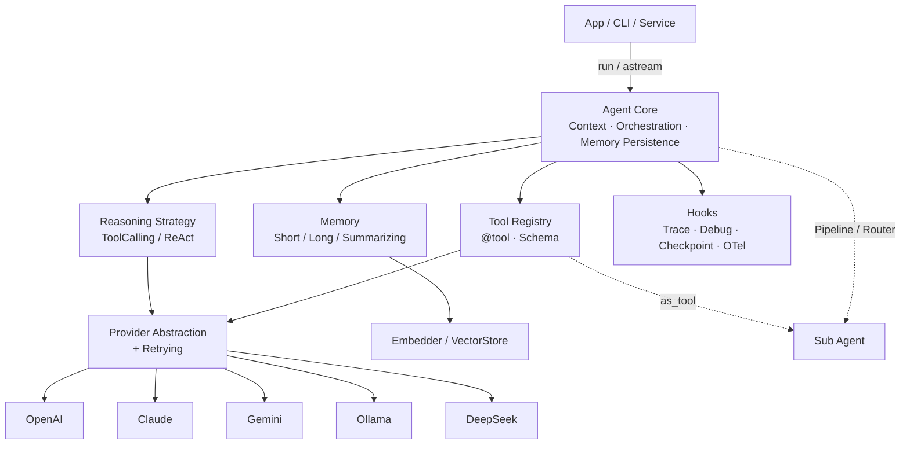

# Morainet AI

> A lightweight, extensible, embeddable **AI Agent Runtime Framework**.
> *"The Spring Framework for AI Agents"*

Morainet AI is an **Agent runtime kernel**: drive any LLM through a unified interface, upgrading a "bare model" into an Agent that can **call tools, retain memory, reason autonomously, be orchestrated, be observable, and be resumable** — all embeddable as a library in your Python applications.

It is not a chatbot product, nor a ready-made solution for a specific vertical; it is the **chassis for building Agents** — on top of it you build customer-service assistants, knowledge Q&A, coding assistants, automation pipelines, or multi-agent systems.

<!-- README-I18N:START -->

**English** | [汉语](./README.zh.md)

<!-- README-I18N:END -->

---

## Table of Contents

- [Why Morainet](#why-morainet)
- [Key Features](#key-features)
- [Architecture Overview](#architecture-overview)
- [Module Overview](#module-overview)
- [Design Philosophy](#design-philosophy)
- [Installation](#installation)
- [Quick Start](#quick-start)
- [Project Structure](#project-structure)
- [Examples](#examples)
- [Testing & CI](#testing--ci)
- [Documentation](#documentation)
- [Roadmap](#roadmap)
- [License](#license)

---

## Why Morainet

| | Morainet's trade-offs |
|: --- | --- |
| **Lightweight kernel** | Core package has no hard LLM SDK dependency (~3000 lines); vendor deps go into optional extras |
| **Zero vendor lock-in** | Unified Provider abstraction — switch between OpenAI / Claude / Gemini / Ollama / DeepSeek in one line |
| **Type-safe** | Pydantic v2 + `mypy --strict` throughout, IDE-friendly and statically checkable |
| **Easy to embed** | Library-first, drop into any existing backend service with no framework constraints |
| **Dual execution model** | Autonomous reasoning (Reasoning Loop) + explicit orchestration (Workflow DAG), choose by scenario |
| **Local-first** | Built-in Mock and Ollama support — zero-cost offline development, data stays on your machine |

Compared to peers: it does **not** compete with model products like ChatGPT/Claude (it calls them); vs. LangChain it is smaller and more readable, vs. CrewAI/AutoGen it is more general-purpose and lighter. Positioned as a **small, stable, embeddable Agent runtime**.

---

## Key Features

- **Tool Calling** — `@tool` decorator auto-generates JSON Schema from type annotations + docstrings, with automatic parameter validation
- **Multi-Provider** — OpenAI / Claude / Gemini / Ollama / DeepSeek; built-in `MockProvider` for offline development
- **Pluggable Reasoning Strategy** — `ToolCallingStrategy` (default, native function calling) / `ReActStrategy` (text-based Reason+Act), fully customizable
- **Streaming Output** — `agent.astream()`, true streaming for OpenAI (SSE) / Ollama (NDJSON) / Claude (SSE) / Gemini (SSE)
- **Memory System** — `ShortMemory` (window / token budget) · `LongMemory` (vector-retrieval RAG) · `SummarizingMemory` (auto-summarization compression)
- **Multi-Agent Orchestration** — Three topologies: hierarchical (`as_tool`) / sequential (`Pipeline`) / routing (`Router`)
- **Workflow Engine** — DAG orchestration, cycle detection + topological level parallel execution, exportable as Mermaid / DOT
- **Prompt Management** — Versioned templates, safe rendering (injection-proof), overridable
- **Observability** — Hook event system + `TraceCollector` structured traces + `Debugger` timeline + OpenTelemetry export
- **State Persistence** — `Checkpoint` (in-memory / file / SQLite), supports resumption via `agent.resume()`
- **Production Hardening** — Exponential backoff retry · token budget · consecutive-failure abort · dangerous-tool human approval
- **Extension Mechanism** — Plugin (entry points dynamic discovery) · MCP integration (tools / resources / prompts)

---

## Architecture Overview

Clear layering: the application layer calls Agent Core; Core orchestrates reasoning strategies, memory, and tools, accessing vendor models through the unified Provider abstraction; observability, persistence, and extensibility run as cross-cutting capabilities throughout.



**An `agent.run()` flow**: Prepare context (system prompt + memory injection) → Reasoning strategy loop (call model → execute tools → feed back results, until convergence) → Trigger hooks (tracing / snapshot) → Persist memory → Return `AgentResult` (containing final answer, step trace, token usage, trace_id).

> Full design in [`docs/architecture.md`](docs/architecture.md); implementation notes and deviations in [`docs/architecture-v1.3.md`](docs/architecture-v1.3.md).

---

## Module Overview

| Module | Responsibility |
|: --- | --- |
| `core/` | `Agent`, `Context`, unified data model (Message / ToolCall / Step / AgentResult) |
| `reasoning/` | `ReasoningStrategy` abstraction + `ToolCallingStrategy` (default) / `ReActStrategy` |
| `tools/` | `@tool` decorator, `ToolRegistry`, type annotations → JSON Schema, `Tool.from_schema` |
| `providers/` | Provider abstraction and vendor implementations, `RetryingProvider`, SSE/NDJSON stream parsing |
| `memory/` | Memory / Embedder / VectorStore abstractions and implementations (Hash/Ollama/OpenAI, InMemory/Chroma) |
| `workflow/` | `Workflow` DAG, level-based parallel executor, Mermaid/DOT export |
| `prompts/` | `PromptTemplate` / `PromptRegistry` / built-in templates |
| `persistence/` | `Checkpoint`, in-memory/file/SQLite Store, `CheckpointHook` |
| `observability/` | `Hook` / `HookManager`, `TraceCollector`, `OTelHook` |
| `mcp/` | `MCPClient`, `stdio_session`, MCP tool/resource/prompt conversion |
| `multiagent.py` | `Pipeline` (sequential) / `Router` (routing) orchestration |
| `plugins.py` | entry points plugin registry |
| `config.py` · `exceptions.py` · `tokens.py` · `debug.py` | Configuration, exception hierarchy, token estimation, Debugger |

---

## Design Philosophy

- **Lightweight kernel + pluggable extensions**: The kernel defines only abstractions and orchestration; all external capabilities (models / vector stores / tools / protocols) connect through interfaces. New vendor dependencies are always placed in optional extras, keeping the kernel dependency-free.
- **Unified intermediate representation**: `Message` / `ToolCall` are the framework's sole internal format. Each Provider handles translation to/from its vendor API, transparent to the kernel — this is the foundation for "one-line model switching".
- **Event-driven cross-cutting capabilities**: Tracing, Checkpoint, Debugger, OTel are all built on the same `Hook` system. The Agent main loop has zero intrusion; adding new observability just means writing a Hook.
- **Honest boundaries**: No model training, no vector database, no hosted UI; focused on Agent Runtime.

---

## Installation

```bash
pip install -e ".[dev]"     # Requires Python 3.11+
```

Optional dependencies: `".[chroma]"` (ChromaDB vector store), `".[mcp]"` (MCP client), `".[otel]"` (OpenTelemetry).

---

## Quick Start

```python
from morainet import Agent, tool
from morainet.providers import OpenAIProvider

@tool
def get_weather(city: str) -> str:
    """Query the current weather of a given city."""
    return f"{city}: sunny, 26°C today"

agent = Agent(provider=OpenAIProvider(model="gpt-4o"), tools=[get_weather])
print(agent.run("What should I wear in Shanghai today?").final_answer)
```

No API key? Switch to a local model (`ollama pull qwen2.5:3b`):

```python
from morainet.providers import OllamaProvider
agent = Agent(provider=OllamaProvider(model="qwen2.5:3b"), tools=[get_weather])
```

For detailed step-by-step tutorials, see the **[GitHub Wiki](../../wiki)**.

---

## Project Structure

```text
morainet-ai/
├── morainet/            # Framework source (see Module Overview)
├── examples/            # Runnable examples covering multiple directions (works offline)
├── tests/               # Unit tests + tests/live (live endpoint integration, excluded by default)
├── docs/                # Architecture design / implementation notes / wiki drafts
├── .github/workflows/   # CI (ruff + mypy + pytest)
├── pyproject.toml
├── CONTRIBUTING.md
└── README.md
```

---

## Examples

`examples/` builds agents in different directions with the same kernel, **runnable offline**:

```bash
python examples/quickstart.py        # Tool calling
python examples/rag_doc_qa.py        # Knowledge / RAG
python examples/coding_assistant.py  # Coding assistant (real tools + validation loop)
python examples/multi_agent.py       # Multi-agent: hierarchical / sequential / routing
```

Full listing in [`examples/README.md`](examples/README.md).

---

## Testing & CI

```bash
pytest                     # Offline unit tests (no key needed, MockProvider)
pytest --cov=morainet      # Coverage (gate: 80%)
pytest -m live             # Live endpoint integration (set credentials; auto-skip if absent)
ruff check morainet tests  # Lint
mypy morainet              # Strict type checking
```

GitHub Actions runs the above checks on Python 3.11 / 3.12.

---

## Documentation

- **Architecture design**: [`docs/architecture.md`](docs/architecture.md)
- **Implementation notes & roadmap**: [`docs/architecture-v1.3.md`](docs/architecture-v1.3.md)
- **Step-by-step tutorials**: [GitHub Wiki](../../wiki)
- **Contributing guide**: [`CONTRIBUTING.md`](CONTRIBUTING.md)

---

## Roadmap

**v1.0** released: Agent Core · Multi-Provider · Streaming · Memory (RAG/summarization) · Multi-Agent · Workflow · Prompt · Observability (Hook/Trace/Debugger/OTel) · Checkpoint (incl. SQLite) · Production hardening (retry/budget/approval) · Plugin · MCP.

Upcoming: all live endpoint tests passing · more vector store backends (Qdrant/pgvector) · context compression in reasoning loop · advanced multi-agent orchestration.

---

## License

MIT
