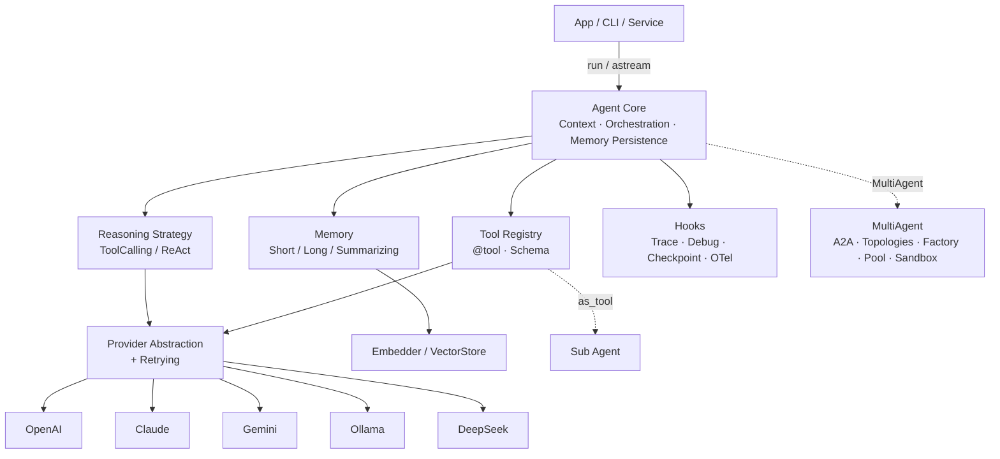

# Morainet AI

> A lightweight, extensible, embeddable **AI Agent Runtime Framework**.
> *"The Spring Framework for AI Agents"*

Morainet AI is an **Agent runtime kernel**: drive any LLM through a unified interface, upgrading a "bare model" into an Agent that can **call tools, retain memory, reason autonomously, be orchestrated, be observable, and be resumable** — all embeddable as a library in your Python applications.

It is not a chatbot product, nor a ready-made solution for a specific vertical; it is the **chassis for building Agents** — on top of it you build customer-service assistants, knowledge Q&A, coding assistants, automation pipelines, or multi-agent systems.

<!-- README-I18N:START -->

**English** | [汉语](./README.zh.md)

<!-- README-I18N:END -->

---

## Table of Contents

- [Why Morainet](#why-morainet)
- [Key Features](#key-features)
- [Architecture Overview](#architecture-overview)
- [Module Overview](#module-overview)
- [Design Philosophy](#design-philosophy)
- [Installation](#installation)
- [Quick Start](#quick-start)
- [Project Structure](#project-structure)
- [Examples](#examples)
- [Testing & CI](#testing--ci)
- [Documentation](#documentation)
- [Roadmap](#roadmap)
- [License](#license)

---

## Why Morainet

| | Morainet's trade-offs |
|: --- | --- |
| **Lightweight kernel** | Core package has no hard LLM SDK dependency (~3000 lines); vendor deps go into optional extras |
| **Zero vendor lock-in** | Unified Provider abstraction — switch between OpenAI / Claude / Gemini / Ollama / DeepSeek in one line |
| **Type-safe** | Pydantic v2 + `mypy --strict` throughout, IDE-friendly and statically checkable |
| **Easy to embed** | Library-first, drop into any existing backend service with no framework constraints |
| **Dual execution model** | Autonomous reasoning (Reasoning Loop) + explicit orchestration (Workflow DAG), choose by scenario |
| **Local-first** | Built-in Mock and Ollama support — zero-cost offline development, data stays on your machine |

Compared to peers: it does **not** compete with model products like ChatGPT/Claude (it calls them); vs. LangChain it is smaller and more readable, vs. CrewAI/AutoGen it is more general-purpose and lighter. Positioned as a **small, stable, embeddable Agent runtime**.

---

## Key Features

- **Tool Calling** — `@tool` decorator auto-generates JSON Schema from type annotations + docstrings, with automatic parameter validation
- **Multi-Provider** — OpenAI / Claude / Gemini / Ollama / DeepSeek / Qwen / Wenxin / Zhipu / Moonshot / MiniMax / SiliconFlow + OpenAI-compatible; built-in `MockProvider` for offline development
- **Model Routing** — `ModelRouter` / `OllamaScheduler` smart routing + `multi_model_query` ensemble; `estimate_complexity` cost-aware dispatch
- **Pluggable Reasoning Strategy** — `ToolCallingStrategy` (default, native function calling) / `ReActStrategy` / `EnhancedReActStrategy` / `PlanSolveReflectStrategy`, with `ContextCompressor` in-loop compression and `ToolCache` result caching
- **Streaming Output** — `agent.astream()`, true streaming for OpenAI (SSE) / Ollama (NDJSON) / Claude (SSE) / Gemini (SSE)
- **Memory System** — `ShortMemory` (window / token budget) · `LongMemory` (vector-retrieval RAG) · `SummarizingMemory` (auto-summarization compression) · `HierarchicalMemory` · `TemporalMemory` · `FactStore` · `TaskGoalStore` · `UserPreferencesStore` · `RAGPipeline` / `KnowledgeBase`
- **Vector Stores** — InMemory / Chroma / Qdrant / pgvector / Faiss / Milvus, with hybrid retrieval + reranking
- **Multi-Agent Orchestration** — A2A native protocol (no intermediary tools) · debate / review / hierarchical delegation / shared memory pool · dynamic agent spawn & lifecycle · resource & permission isolation · agent pooling · group chat
- **Workflow Engine** — DAG orchestration, cycle detection + topological level parallel execution, exportable as Mermaid / DOT
- **Prompt Management** — Versioned templates, safe rendering (injection-proof), overridable
- **Observability** — Hook event system + `TraceCollector` structured traces + `Debugger` timeline + OpenTelemetry export + distributed trace
- **State Persistence** — `Checkpoint` (in-memory / file / SQLite / Redis / PostgreSQL), supports resumption via `agent.resume()`
- **Production Hardening** — Exponential backoff retry (incl. error-category-based `CategorizedRetryingProvider`) · token budget · consecutive-failure abort · dangerous-tool human approval · `PermissionEnforcer` / `ApprovalFlow` / `AuditLogger`
- **Engineering Controls** — `TokenBucketRateLimiter` / `SlidingWindowRateLimiter` rate limiting · `ConcurrencyLimiter` · `BillingTracker` cost accounting · `CircuitBreaker`
- **Extension Mechanism** — Plugin (entry points dynamic discovery + marketplace) · MCP integration (tools / resources / prompts, pool + cache)
- **Multimodal** — image / audio / file content parts, image understanding / OCR / chart parsing / speech-to-text tools, multimodal RAG (`MultimodalRAG` / `VisionReasoningChain`), pluggable provider adapters
- **Distributed** — task queue (Redis / RabbitMQ backends) · DAG distributed scheduling · agent cluster & consistent-hash sharding · load balancing (round-robin / weighted / hybrid) · cloud/edge heuristics · distributed checkpoint
- **Debug Tooling** — local debug panel (`morainet-debug`) + Mermaid export (HTML / SVG / PNG) + CLI (`morainet chat`)

---

## Architecture Overview

Clear layering: the application layer calls Agent Core; Core orchestrates reasoning strategies, memory, and tools, accessing vendor models through the unified Provider abstraction; observability, persistence, and extensibility run as cross-cutting capabilities throughout.


```mermaid
flowchart TD
    App[App / CLI / Service] -->|run / astream| Core[Agent Core<br/>Context · Orchestration · Memory Persistence]

    Core --> Reasoning[Reasoning Strategy<br/>ToolCalling / ReAct]
    Core --> Memory[Memory<br/>Short / Long / Summarizing]
    Core --> Tools[Tool Registry<br/>@tool · Schema]
    Core --> Hooks[Hooks<br/>Trace · Debug · Checkpoint · OTel]

    Reasoning --> Provider[Provider Abstraction<br/>+ Retrying]
    Tools --> Provider
    Memory --> Embed[Embedder / VectorStore]

    Provider --> OpenAI & Claude & Gemini & Ollama & DeepSeek

    Tools -. as_tool .-> Sub[Sub Agent]
    Core -. MultiAgent .-> Multi[MultiAgent<br/>A2A · Topologies · Factory · Pool · Sandbox]
```

**An `agent.run()` flow**: Prepare context (system prompt + memory injection) → Reasoning strategy loop (call model → execute tools → feed back results, until convergence) → Trigger hooks (tracing / snapshot) → Persist memory → Return `AgentResult` (containing final answer, step trace, token usage, trace_id).

> Full design in [`docs/architecture.md`](docs/architecture.md); implementation notes and deviations in [`docs/architecture-v1.4.md`](docs/architecture-v1.4.md).

---

## Module Overview

| Module | Responsibility |
|: --- | --- |
| `core/` | `Agent`, `Context`, unified data model (Message / ToolCall / Step / AgentResult) |
| `reasoning/` | `ReasoningStrategy` abstraction + `ToolCallingStrategy` (default) / `ReActStrategy` / `EnhancedReActStrategy` / `PlanSolveReflectStrategy` · `ContextCompressor` · `ToolCache` |
| `tools/` | `@tool` decorator, `ToolRegistry`, type annotations → JSON Schema, `Tool.from_schema`, permission / approval / audit |
| `providers/` | Provider abstraction + 13 vendor implementations, `RetryingProvider`, `ModelRouter`, SSE/NDJSON stream parsing |
| `memory/` | Memory / Embedder / VectorStore abstractions and implementations (6 backends), RAG / KnowledgeBase / fact & goal stores |
| `workflow/` | `Workflow` DAG, level-based parallel executor, Mermaid/DOT export, pluggable schedulers |
| `prompts/` | `PromptTemplate` / `PromptRegistry` / built-in templates |
| `persistence/` | `Checkpoint`, in-memory/file/SQLite/Redis/PostgreSQL Store, `CheckpointHook` |
| `observability/` | `Hook` / `HookManager`, `TraceCollector`, `DistributedRunTrace`, `OTelHook` |
| `mcp/` | `MCPClient`, `stdio_session`, MCP tool/resource/prompt conversion, pool + cache |
| `multiagent/` | A2A protocol · debate/review/hierarchical/shared-memory topologies · group chat · `TeamOrchestrator` · `AgentFactory` dynamic spawn · `AgentPool` · `AgentSandbox` isolation |
| `multimodal/` | Image/audio/file content parts, vision/OCR/chart/speech tools, multimodal RAG, provider adapters |
| `distributed/` | Task queue · DAG distributed scheduling · agent cluster & sharding · load balancing · distributed checkpoint |
| `engineering/` | Rate limiting · concurrency control · billing tracking · circuit breaker |
| `cli/` · `debug_panel/` | `morainet chat` CLI · local debug panel with Mermaid export |
| `plugins.py` | entry points plugin registry + marketplace |

---

## Design Philosophy

- **Lightweight kernel + pluggable extensions**: The kernel defines only abstractions and orchestration; all external capabilities (models / vector stores / tools / protocols) connect through interfaces. New vendor dependencies are always placed in optional extras, keeping the kernel dependency-free.
- **Unified intermediate representation**: `Message` / `ToolCall` are the framework's sole internal format. Each Provider handles translation to/from its vendor API, transparent to the kernel — this is the foundation for "one-line model switching".
- **Event-driven cross-cutting capabilities**: Tracing, Checkpoint, Debugger, OTel are all built on the same `Hook` system. The Agent main loop has zero intrusion; adding new observability just means writing a Hook.
- **Honest boundaries**: No model training, no vector database, no hosted UI; focused on Agent Runtime.

---

## Installation

Stable release (requires Python 3.11+):

```bash
pip install morainet-ai
```

Pre-release (alpha / beta / rc):

```bash
pip install --pre morainet-ai
```

Development install (from source):

```bash
pip install -e ".[dev]"
```

Optional dependencies: `".[chroma]"` (ChromaDB vector store), `".[qdrant]"` / `".[pgvector]"` / `".[faiss]"` / `".[milvus]"` (vector stores), `".[mcp]"` (MCP client), `".[otel]"` (OpenTelemetry), `".[redis]"` / `".[postgres]"` (distributed/persistence backends), `".[rag]"` (full RAG stack).

---

## Quick Start

```python
from morainet import Agent, tool
from morainet.providers import OpenAIProvider

@tool
def get_weather(city: str) -> str:
    """Query the current weather of a given city."""
    return f"{city}: sunny, 26°C today"

agent = Agent(provider=OpenAIProvider(model="gpt-4o"), tools=[get_weather])
print(agent.run("What should I wear in Shanghai today?").final_answer)
```

No API key? Switch to a local model (`ollama pull qwen2.5:3b`):

```python
from morainet.providers import OllamaProvider
agent = Agent(provider=OllamaProvider(model="qwen2.5:3b"), tools=[get_weather])
```

For detailed step-by-step tutorials, see the **[GitHub Wiki](../../wiki)**.

---

## Project Structure

```text
morainet-ai/
├── morainet/            # Framework source (see Module Overview)
├── examples/            # Runnable examples covering multiple directions (works offline)
├── tests/               # Unit tests + tests/live (live endpoint integration, excluded by default)
├── docs/                # Architecture design / implementation notes / wiki drafts
├── .github/workflows/   # CI (ruff + mypy + pytest)
├── pyproject.toml
├── CONTRIBUTING.md
└── README.md
```

---

## Examples

`examples/` builds agents in different directions with the same kernel, **runnable offline**:

```bash
python examples/quickstart.py        # Tool calling
python examples/rag_doc_qa.py        # Knowledge / RAG
python examples/coding_assistant.py  # Coding assistant (real tools + validation loop)
python examples/multi_agent.py       # Multi-agent: hierarchical / sequential / routing
python examples/multiagent_collaboration_demo.py  # Advanced: A2A protocol / debate / review / delegation / sandbox
```

Full listing in [`examples/README.md`](examples/README.md).

---

## Testing & CI

```bash
pytest                     # Offline unit tests (no key needed, MockProvider)
pytest --cov=morainet      # Coverage (gate is enforced in CI)
pytest -m live             # Live endpoint integration (set credentials; auto-skip if absent)
ruff check morainet tests  # Lint
mypy morainet              # Strict type checking
```

GitHub Actions runs the above checks on Python 3.11 / 3.12. See [`CONTRIBUTING.md`](CONTRIBUTING.md) for details.

---

## Documentation

- **Architecture design**: [`docs/architecture.md`](docs/architecture.md)
- **Implementation notes & roadmap**: [`docs/architecture-v1.4.md`](docs/architecture-v1.4.md)
- **Changelog**: [`CHANGELOG.md`](CHANGELOG.md)
- **Step-by-step tutorials**: [GitHub Wiki](../../wiki)
- **Contributing guide**: [`CONTRIBUTING.md`](CONTRIBUTING.md)

---

## Roadmap

**v1.0** released: Agent Core · Multi-Provider · Streaming · Memory (RAG/summarization) · Multi-Agent (A2A · debate/review/delegation/pool · sandbox) · Workflow · Prompt · Observability (Hook/Trace/Debugger/OTel) · Checkpoint (incl. SQLite) · Production hardening (retry/budget/approval) · Plugin · MCP.

**v1.1 – v1.3** (unreleased milestones, code landed): more vector store backends (Qdrant / pgvector / Faiss / Milvus) · context compression in reasoning loop (`ContextCompressor`) · tool security (`PermissionEnforcer` / `ApprovalFlow` / `AuditLogger`) · engineering controls (rate limit / concurrency / billing / circuit breaker) · model routing (`ModelRouter` / `OllamaScheduler`).

**v1.4** (current, code-complete): Multimodal (image/audio parts · vision/OCR/chart/speech tools · multimodal RAG) · Distributed (task queue · DAG scheduling · cluster & sharding · load balancing · distributed checkpoint) · Redis/PostgreSQL checkpoint stores · CLI + local debug panel.

Upcoming (see [`docs/architecture-v1.4.md`](docs/architecture-v1.4.md)):
- Raise coverage gate back toward 70%+ (new module tests)
- Verify all `pytest -m live` endpoints green with real keys
- Distributed module production hardening (queue persistence/retry, cluster failover scenarios)
- Full docs/wiki rewrite organized by capability area

---

## License

MIT
