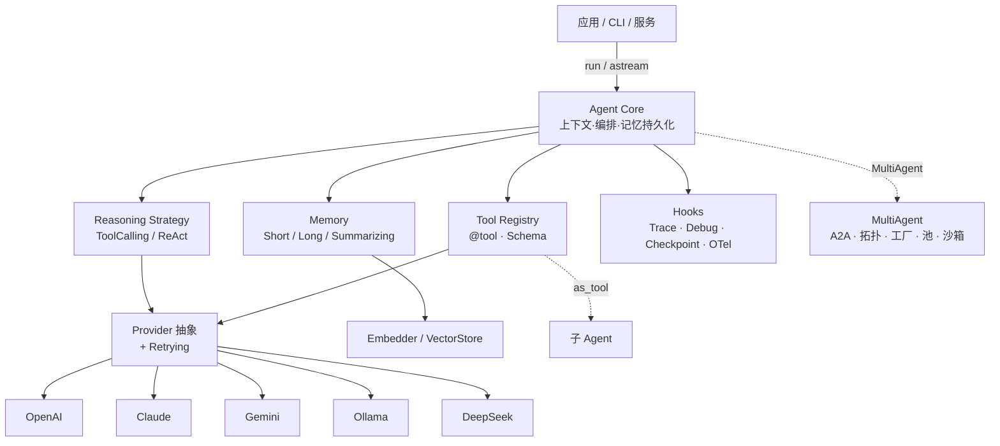

# Morainet AI

> 一个轻量、可扩展、易嵌入的 **AI Agent Runtime Framework**。
> *"AI Agent 的 Spring Framework"*

Morainet AI 是一套 **Agent 运行时内核**：用统一的接口驱动任意大模型，把"裸模型"升级成能**调用工具、拥有记忆、自主推理、可被编排、可观测、可恢复**的 Agent，并以库的形式嵌入你的 Python 应用。

它不是聊天产品，也不是某个垂直场景的成品；它是**搭建 Agent 的底盘**——你在它之上构建客服助手、知识问答、编码助手、自动化流程或多 Agent 系统。

<!-- README-I18N:START -->

[English](./README.md) | **汉语**

<!-- README-I18N:END -->

---

## 目录

- [为什么是 Morainet](#为什么是-morainet)
- [核心特性](#核心特性)
- [整体架构](#整体架构)
- [模块一览](#模块一览)
- [设计理念](#设计理念)
- [安装](#安装)
- [快速上手](#快速上手)
- [项目结构](#项目结构)
- [示例](#示例)
- [测试与 CI](#测试与-ci)
- [文档](#文档)
- [路线图](#路线图)
- [License](#license)

---

## 为什么是 Morainet

| | Morainet 的取舍 |
| --- | --- |
| **轻量内核** | 核心包不强依赖任何 LLM SDK（约 3000 行）；厂商依赖走可选 extras |
| **零厂商锁定** | 统一 Provider 抽象，一行切换 OpenAI / Claude / Gemini / Ollama / DeepSeek |
| **类型安全** | 全程 Pydantic v2 + `mypy --strict`，IDE 友好、可静态检查 |
| **易嵌入** | 库优先，可直接塞进现有后端服务，无强框架约束 |
| **双执行模型** | 自主推理（Reasoning Loop）+ 显式编排（Workflow DAG），按场景选择 |
| **本地优先** | 内置 Mock 与 Ollama 支持，零成本离线开发、数据不出本机 |

与同类的关系：它**不**和 ChatGPT/Claude 这类模型产品竞争（反而调用它们）；相比 LangChain 更小更可读，相比 CrewAI/AutoGen 更通用、更轻。定位是**小而稳、易嵌入的 Agent 运行时**。

---

## 核心特性

- **Tool Calling** —— `@tool` 装饰器从类型注解 + docstring 自动生成 JSON Schema，自动校验参数
- **多 Provider** —— OpenAI / Claude / Gemini / Ollama / DeepSeek / Qwen / 文心 / 智谱 / Moonshot / MiniMax / SiliconFlow + OpenAI 兼容，内置 `MockProvider` 离线可跑
- **模型路由** —— `ModelRouter` / `OllamaScheduler` 智能路由 + `multi_model_query` 多模型对比，`estimate_complexity` 按成本调度
- **可插拔推理策略** —— `ToolCallingStrategy`（默认，原生函数调用）/ `ReActStrategy` / `EnhancedReActStrategy` / `PlanSolveReflectStrategy`，内置 `ContextCompressor` 循环内压缩与 `ToolCache` 结果缓存
- **流式输出** —— `agent.astream()`，OpenAI(SSE) / Ollama(NDJSON) / Claude(SSE) / Gemini(SSE) 真流式
- **记忆系统** —— `ShortMemory`（窗口 / token 预算）· `LongMemory`（向量检索 RAG）· `SummarizingMemory`（自动摘要压缩）· `HierarchicalMemory` 分层记忆 · `TemporalMemory` 时间感知 · `FactStore` 事实库 · `TaskGoalStore` 目标库 · `UserPreferencesStore` 偏好库 · `RAGPipeline` / `KnowledgeBase`
- **向量库** —— InMemory / Chroma / Qdrant / pgvector / Faiss / Milvus 六种后端，支持混合检索 + 重排
- **多 Agent 编排** —— A2A 原生协议（无需中转工具）· 辩论 / 评审 / 分层委托 / 共享记忆池 · 动态 Agent 生成与生命周期 · 资源与权限隔离 · Agent 池化复用 · 群聊
- **Workflow 引擎** —— DAG 编排，环检测 + 拓扑分层并行执行，可导出 Mermaid / DOT
- **Prompt 管理** —— 版本化模板、安全渲染（防注入）、可覆盖
- **可观测性** —— Hook 事件系统 + `TraceCollector` 结构化轨迹 + `Debugger` 时间线 + OpenTelemetry 导出 + 分布式轨迹
- **状态持久化** —— `Checkpoint`（内存 / 文件 / SQLite / Redis / PostgreSQL），支持断点恢复 `agent.resume()`
- **生产化** —— 指数退避重试（含按错误分类的 `CategorizedRetryingProvider`）· token 预算 · 连续失败中止 · 危险工具人工审批 · `PermissionEnforcer` 权限强制 / `ApprovalFlow` 审批流 / `AuditLogger` 审计
- **工程治理** —— `TokenBucketRateLimiter` / `SlidingWindowRateLimiter` 限流 · `ConcurrencyLimiter` 并发控制 · `BillingTracker` 成本核算 · `CircuitBreaker` 熔断
- **扩展机制** —— Plugin（entry points 动态发现 + 市场）· MCP 集成（工具 / 资源 / 提示，含连接池 + 缓存）
- **多模态** —— 图片 / 音频 / 文件内容部件，图像理解 / OCR / 图表解析 / 语音转文字工具，多模态 RAG（`MultimodalRAG` / `VisionReasoningChain`），可插拔 Provider 适配器
- **分布式** —— 任务队列（Redis / RabbitMQ 后端）· DAG 分布式调度 · Agent 集群与一致性哈希分片 · 负载均衡（轮询 / 加权 / 混合路由）· 云边协同 · 分布式 Checkpoint
- **调试工具** —— 本地调试面板（`morainet-debug`）+ Mermaid 导出（HTML / SVG / PNG）+ CLI（`morainet chat`）

---

## 整体架构

分层清晰：应用层调用 Agent Core，Core 编排推理策略、记忆与工具，统一经 Provider 抽象访问各家模型；可观测、持久化、扩展作为横切能力贯穿全程。


```mermaid
flowchart TD
    App[应用 / CLI / 服务] -->|run / astream| Core[Agent Core<br/>上下文·编排·记忆持久化]

    Core --> Reasoning[Reasoning Strategy<br/>ToolCalling / ReAct]
    Core --> Memory[Memory<br/>Short / Long / Summarizing]
    Core --> Tools[Tool Registry<br/>@tool · Schema]
    Core --> Hooks[Hooks<br/>Trace · Debug · Checkpoint · OTel]

    Reasoning --> Provider[Provider 抽象<br/>+ Retrying]
    Tools --> Provider
    Memory --> Embed[Embedder / VectorStore]

    Provider --> OpenAI & Claude & Gemini & Ollama & DeepSeek

    Tools -. as_tool .-> Sub[子 Agent]
    Core -. MultiAgent .-> Multi[MultiAgent<br/>A2A · 拓扑 · 工厂 · 池 · 沙箱]
```

**一次 `agent.run()` 的流程**：准备上下文（系统提示 + 记忆注入）→ 推理策略循环（调模型 → 执行工具 → 回灌结果，直到收敛）→ 触发 Hook（追踪 / 快照）→ 持久化记忆 → 返回 `AgentResult`（含最终答案、步骤轨迹、token 用量、trace_id）。

> 完整设计见 [`docs/architecture.md`](docs/architecture.md)，实现说明与差异见 [`docs/architecture-v1.4.md`](docs/architecture-v1.4.md)。

---

## 模块一览

| 模块 | 职责 |
| --- | --- |
| `core/` | `Agent`、`Context`、统一数据模型（Message / ToolCall / Step / AgentResult） |
| `reasoning/` | `ReasoningStrategy` 抽象 + `ToolCallingStrategy`（默认）/ `ReActStrategy` / `EnhancedReActStrategy` / `PlanSolveReflectStrategy` · `ContextCompressor` · `ToolCache` |
| `tools/` | `@tool` 装饰器、`ToolRegistry`、类型注解 → JSON Schema、`Tool.from_schema`、权限 / 审批 / 审计 |
| `providers/` | Provider 抽象与 13 家实现、`RetryingProvider`、`ModelRouter`、SSE/NDJSON 流式解析 |
| `memory/` | Memory / Embedder / VectorStore 抽象与实现（6 种后端），RAG / KnowledgeBase / 事实与目标库 |
| `workflow/` | `Workflow` DAG、分层并行执行器、Mermaid/DOT 导出、可插拔调度器 |
| `prompts/` | `PromptTemplate` / `PromptRegistry` / 内置模板 |
| `persistence/` | `Checkpoint`、内存/文件/SQLite/Redis/PostgreSQL Store、`CheckpointHook` |
| `observability/` | `Hook` / `HookManager`、`TraceCollector`、`DistributedRunTrace`、`OTelHook` |
| `mcp/` | `MCPClient`、`stdio_session`、MCP 工具/资源/提示转换、连接池 + 缓存 |
| `multiagent/` | A2A 协议 · 辩论/评审/分层委托/共享记忆池拓扑 · 群聊 · `TeamOrchestrator` · `AgentFactory` 动态生成 · `AgentPool` · `AgentSandbox` 隔离 |
| `multimodal/` | 图片/音频/文件内容部件，视觉/OCR/图表/语音工具，多模态 RAG，Provider 适配器 |
| `distributed/` | 任务队列 · DAG 分布式调度 · Agent 集群与分片 · 负载均衡 · 分布式 Checkpoint |
| `engineering/` | 限流 · 并发控制 · 计费统计 · 熔断 |
| `cli/` · `debug_panel/` | `morainet chat` CLI · 本地调试面板（Mermaid 导出） |
| `plugins.py` | entry points 插件注册表 + 市场 |

---

## 设计理念

- **轻量内核 + 可插拔扩展**：内核只定义抽象与编排，所有外部能力（模型 / 向量库 / 工具 / 协议）通过接口接入；新增厂商依赖一律放进可选 extras，保持内核零依赖。
- **统一中间表示**：`Message` / `ToolCall` 是框架内部唯一格式，各 Provider 负责与自家 API 互译，对内核透明——这是"一行切换模型"的基础。
- **事件驱动的横切能力**：Tracing、Checkpoint、Debugger、OTel 全部建在同一套 `Hook` 系统上，Agent 主循环零侵入，新增可观测能力只需写一个 Hook。
- **诚实的边界**：不做模型训练、不做向量库、不做托管 UI；专注 Agent Runtime。

---

## 安装

稳定版（需 Python 3.11+）：

```bash
pip install morainet-ai
```

预发布版（alpha / beta / rc）：

```bash
pip install --pre morainet-ai
```

开发安装（从源码）：

```bash
pip install -e ".[dev]"
```

可选依赖：`".[chroma]"`（ChromaDB 向量库）、`".[qdrant]"` / `".[pgvector]"` / `".[faiss]"` / `".[milvus]"`（其他向量库）、`".[mcp]"`（MCP 客户端）、`".[otel]"`（OpenTelemetry）、`".[redis]"` / `".[postgres]"`（分布式/持久化后端）、`".[rag]"`（完整 RAG 栈）。

---

## 快速上手

```python
from morainet import Agent, tool
from morainet.providers import OpenAIProvider

@tool
def get_weather(city: str) -> str:
    """查询指定城市的当前天气。"""
    return f"{city} 今天晴，26°C"

agent = Agent(provider=OpenAIProvider(model="gpt-4o"), tools=[get_weather])
print(agent.run("上海今天适合穿什么？").final_answer)
```

无 API key？换成本地模型即可（`ollama pull qwen2.5:3b`）：

```python
from morainet.providers import OllamaProvider
agent = Agent(provider=OllamaProvider(model="qwen2.5:3b"), tools=[get_weather])
```

更详细的分步教程见 **[GitHub Wiki](../../wiki)**。

---

## 项目结构

```text
morainet-ai/
├── morainet/            # 框架源码（见「模块一览」）
├── examples/            # 覆盖多方向的可运行示例（离线即可跑）
├── tests/               # 单元测试 + tests/live（真端点联调，默认排除）
├── docs/                # 架构设计 / 实现说明 / wiki 草稿
├── .github/workflows/   # CI（ruff + mypy + pytest）
├── pyproject.toml
├── CONTRIBUTING.md
└── README.md
```

---

## 示例

`examples/` 用同一套内核搭出不同方向的 Agent，**离线即可运行**：

```bash
python examples/quickstart.py        # 工具调用
python examples/rag_doc_qa.py        # 知识 / RAG
python examples/coding_assistant.py  # 编码助手（真实工具 + 验证闭环）
python examples/multi_agent.py       # 多 Agent：层级 / 顺序 / 路由
python examples/multiagent_collaboration_demo.py  # 进阶：A2A 协议 / 辩论 / 评审 / 委托 / 沙箱
```

完整清单见 [`examples/README.md`](examples/README.md)。

---

## 测试与 CI

```bash
pytest                     # 离线单测（不需 key，MockProvider）
pytest --cov=morainet      # 覆盖率（门禁在 CI 中强制执行）
pytest -m live             # 真实端点联调（设好凭证；无凭证自动跳过）
ruff check morainet tests  # lint
mypy morainet              # 严格类型检查
```

GitHub Actions 在 Python 3.11 / 3.12 上运行上述检查。详见 [`CONTRIBUTING.md`](CONTRIBUTING.md)。

---

## 文档

- **架构设计**：[`docs/architecture.md`](docs/architecture.md)
- **实现说明与路线**：[`docs/architecture-v1.4.md`](docs/architecture-v1.4.md)
- **更新日志**：[`CHANGELOG.md`](CHANGELOG.md)
- **分步教程**：[GitHub Wiki](../../wiki)
- **贡献指南**：[`CONTRIBUTING.md`](CONTRIBUTING.md)

---

## 路线图

已发布 **v1.0**：Agent Core · 多 Provider · 流式 · 记忆(RAG/摘要) · 多 Agent（A2A · 辩论/评审/委托/池 · 沙箱）· Workflow · Prompt · 可观测(Hook/Trace/Debugger/OTel) · Checkpoint(含 SQLite) · 生产化(重试/预算/审批) · Plugin · MCP。

**v1.1 – v1.3**（代码已落地）：更多向量库后端（Qdrant / pgvector / Faiss / Milvus）· 上下文压缩进推理循环（`ContextCompressor`）· 工具安全（`PermissionEnforcer` / `ApprovalFlow` / `AuditLogger`）· 工程治理（限流 / 并发 / 计费 / 熔断）· 模型路由（`ModelRouter` / `OllamaScheduler`）。

**v1.4**（当前，代码完整）：多模态（图片/音频内容 · 视觉/OCR/图表/语音工具 · 多模态 RAG）· 分布式（任务队列 · DAG 调度 · 集群与分片 · 负载均衡 · 分布式 Checkpoint）· Redis/PostgreSQL Checkpoint Store · CLI + 本地调试面板。

后续方向（详见 [`docs/architecture-v1.4.md`](docs/architecture-v1.4.md)）：
- 覆盖率门禁回升到 70%+（新模块补测）
- 真实 key 跑通全部 `pytest -m live` 端点
- 分布式模块生产加固（队列持久化/重试、集群故障转移场景）
- 按能力域重构 docs/wiki

---

## License

MIT
