# Morainet AI 架构图解

> Mermaid 架构图集合，展示各层模块关系与交互流程。

---

## 1. 整体分层架构

```mermaid
flowchart TD
    subgraph App["Application Layer"]
        CLI[CLI / Script]
        WEB[Web / FastAPI]
        GRPC[gRPC Service]
    end

    subgraph Core["Agent Core"]
        AGENT[Agent Runtime]
        LIFECYCLE[Lifecycle Manager]
        CONTEXT[Context Manager]
    end

    subgraph Reasoning["Reasoning Engine"]
        TCS[ToolCallingStrategy]
        REACT[ReActStrategy]
        PSR[PlanSolveReflect]
        CC[ContextCompressor]
        TC[ToolCache]
    end

    subgraph Memory["Memory System"]
        SHORT[ShortMemory]
        LONG[LongMemory]
        SUMM[SummarizingMemory]
        COMP[CompositeMemory]
    end

    subgraph Tools["Tool System"]
        DECORATOR[@tool Decorator]
        REGISTRY[ToolRegistry]
        SCHEMA[Schema Generator]
        APPROVAL[Approval Flow]
        AUDIT[Audit System]
    end

    subgraph Workflow["Workflow Engine"]
        DAG[DAG Builder]
        SERIAL[SerialScheduler]
        PARALLEL[ParallelScheduler]
        PROGRESS[ProgressScheduler]
    end

    subgraph Provider["Provider Layer"]
        ABSTRACT[Provider Interface]
        OPENAI[OpenAI]
        CLAUDE[Claude]
        GEMINI[Gemini]
        OLLAMA[Ollama]
        DEEPSEEK[DeepSeek]
        QWEN[Qwen]
        ROUTER[ModelRouter]
        RETRY[RetryingProvider]
    end

    subgraph Infra["Infrastructure"]
        VECTOR[(VectorStore)]
        CKPT[(CheckpointStore)]
        CACHE[(Cache)]
        LIMITER[Rate Limiter]
        CB[Circuit Breaker]
        BILLING[Billing Tracker]
    end

    subgraph Ext["Extension"]
        PLUGIN[Plugin System]
        MCP[MCP Client / Pool]
        MKT[Plugin Marketplace]
    end

    subgraph Obs["Observability"]
        HOOK[Hook System]
        DEBUG[Debugger]
        TRACE[TraceCollector]
        OTEL[OpenTelemetry]
    end

    CLI --> AGENT
    WEB --> AGENT
    GRPC --> AGENT

    AGENT --> Reasoning
    AGENT --> Memory
    AGENT --> Tools
    AGENT --> Workflow

    Reasoning --> ABSTRACT
    Tools --> ABSTRACT

    Memory --> VECTOR

    ABSTRACT --> OPENAI
    ABSTRACT --> CLAUDE
    ABSTRACT --> GEMINI
    ABSTRACT --> OLLAMA
    ABSTRACT --> DEEPSEEK
    ABSTRACT --> QWEN

    AGENT --> Infra
    AGENT --> Obs
    AGENT --> Ext

    AGENT --> CKPT
```

---

## 2. Agent Runtime 执行序列

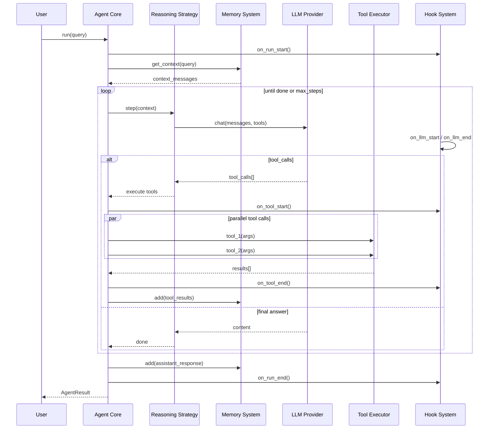

---

## 3. 推理策略决策树

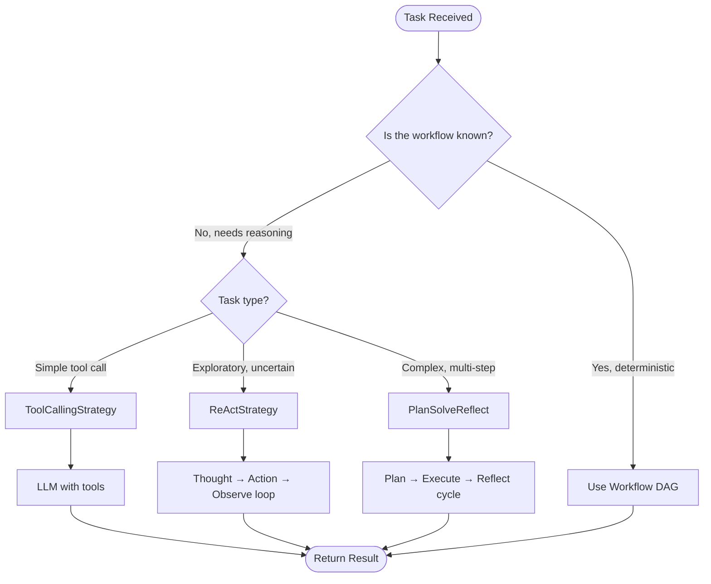

---

## 4. Memory 系统架构

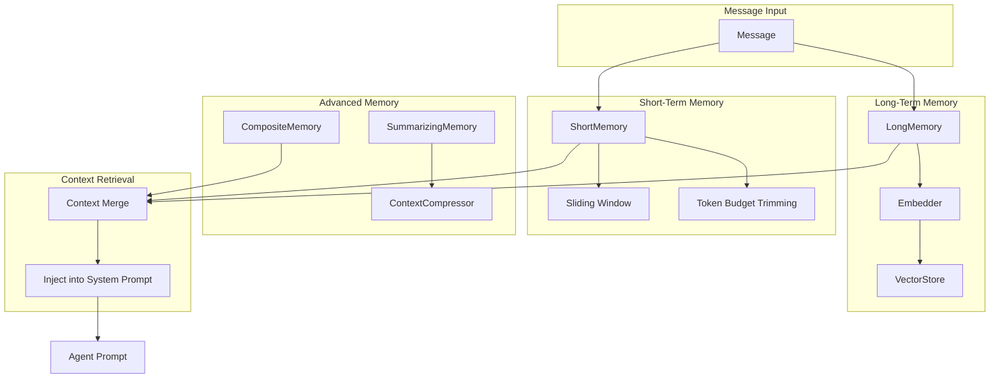

---

## 5. Provider 路由与容错

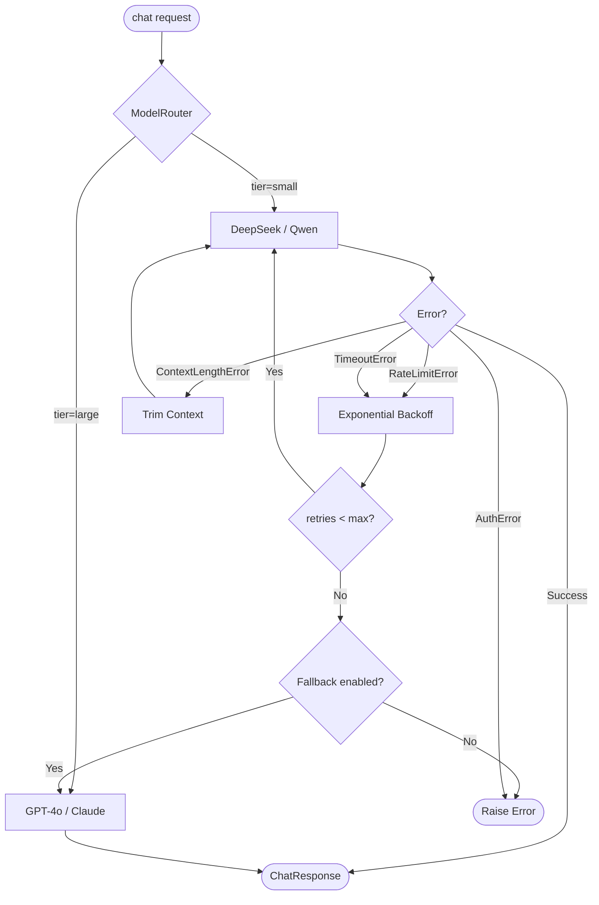

---

## 6. Workflow DAG 执行模型

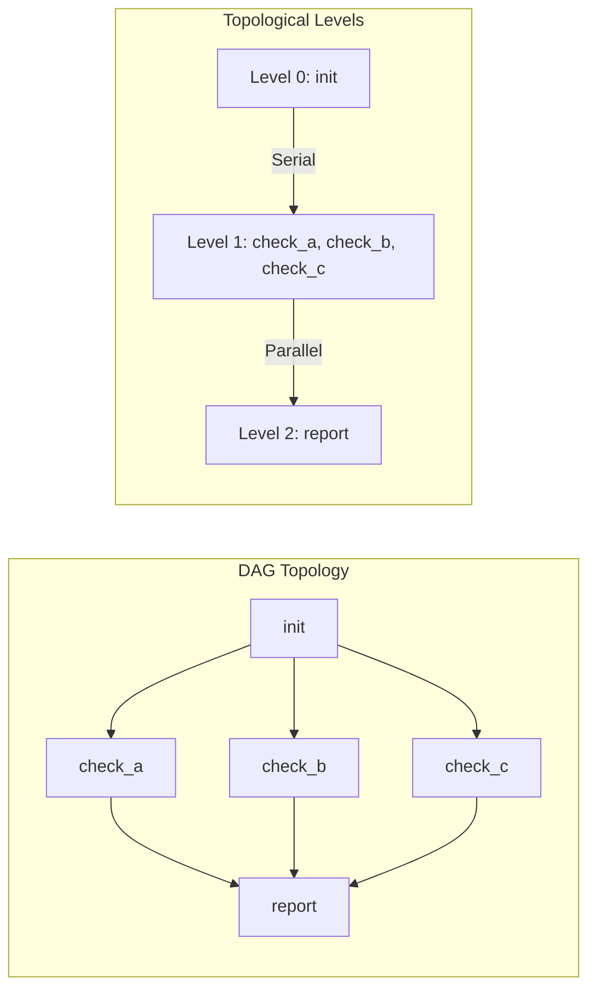

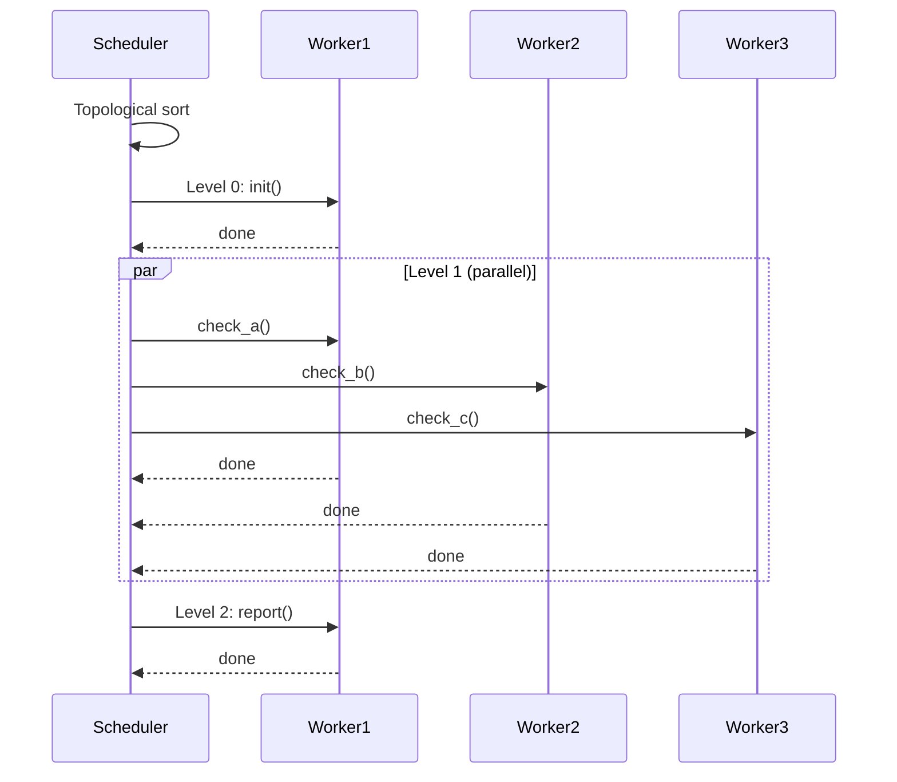

---

## 7. Plugin / MCP 扩展机制

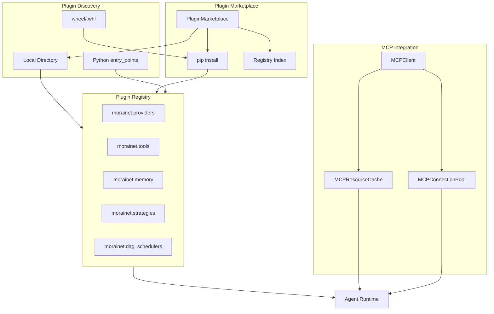

---

## 8. Checkpoint 持久化流程

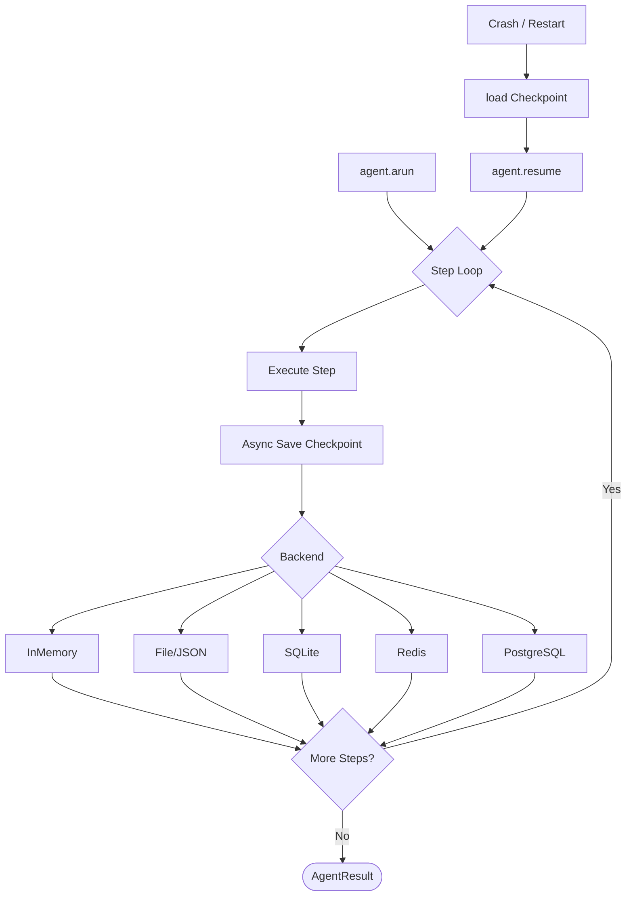

---

## 9. 异常处理与重试机制

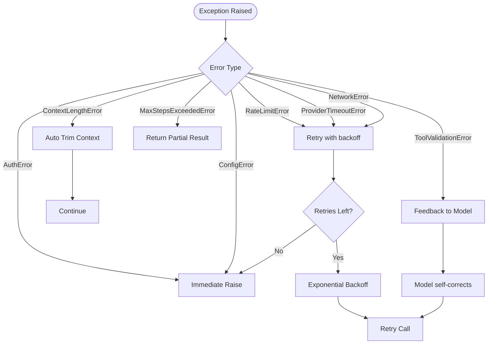

---

## 10. 企业级部署拓扑

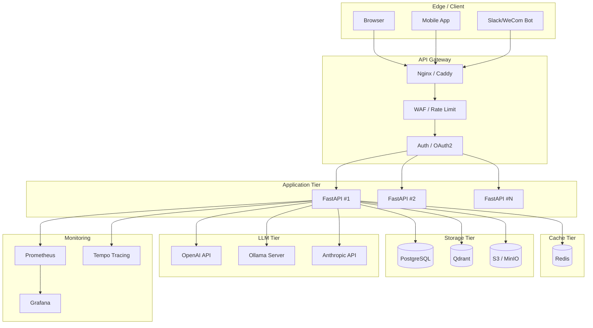

---

## 11. 数据流全景

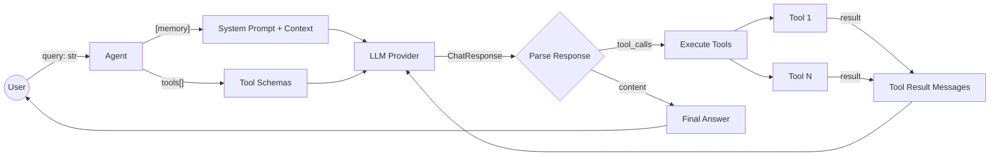

---

> 配合阅读：[API Reference](api-reference.md) · [性能调优指南](performance-tuning.md) · [部署指南](deployment.md)
