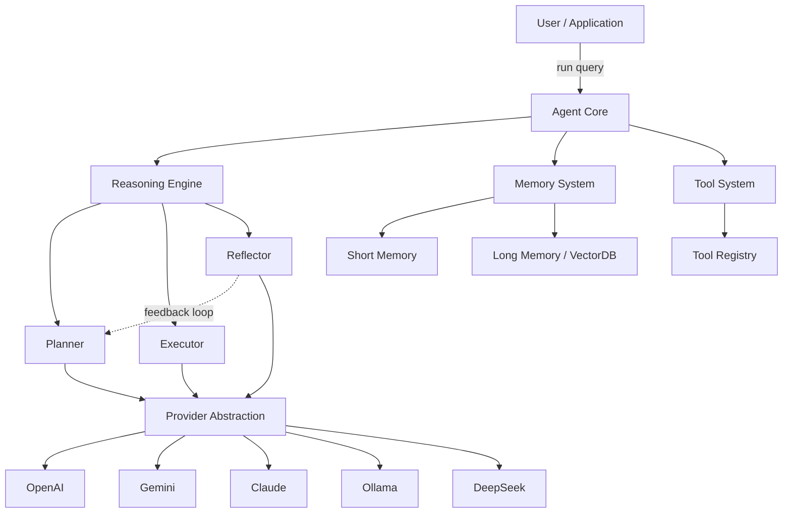
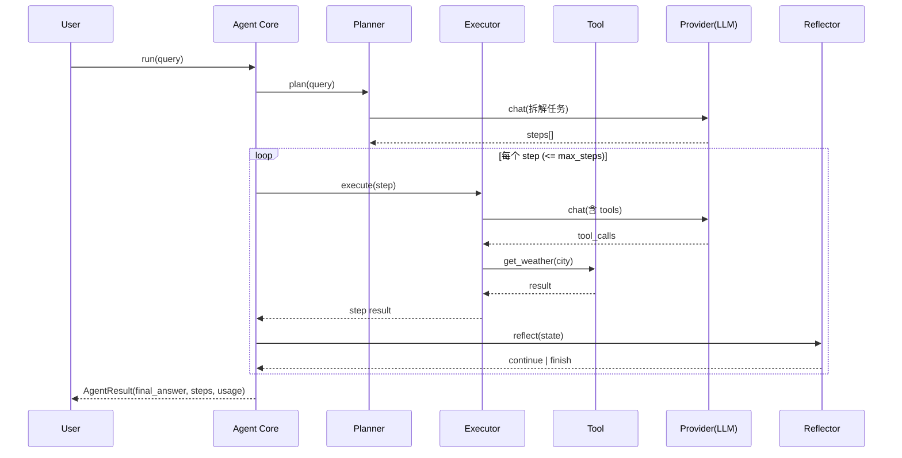

# Morainet AI 技术设计文档

> **版本**：v1.2 · **状态**：Draft · **更新**：2026-06-16
>
> 一个轻量、可扩展、易嵌入的 **AI Agent Runtime Framework**。

---

## 目录

1. [项目概述](#1-项目概述)
2. [设计目标与非目标](#2-设计目标与非目标)
3. [与同类框架对比（定位）](#3-与同类框架对比定位)
4. [核心概念与术语](#4-核心概念与术语)
5. [整体架构](#5-整体架构)
6. [核心数据模型](#6-核心数据模型)
7. [核心模块设计](#7-核心模块设计)
8. [推理策略详解](#8-推理策略详解)
9. [运行时执行流程](#9-运行时执行流程)
10. [Prompt 管理](#10-prompt-管理)
11. [状态持久化与 Checkpoint](#11-状态持久化与-checkpoint)
12. [异常体系与错误处理](#12-异常体系与错误处理)
13. [横切关注点](#13-横切关注点cross-cutting-concerns)
14. [Plugin / MCP 扩展设计](#14-plugin--mcp-扩展设计)
15. [项目目录结构](#15-项目目录结构)
16. [技术选型](#16-技术选型)
17. [配置管理](#17-配置管理)
18. [测试策略](#18-测试策略)
19. [端到端示例](#19-端到端示例)
20. [贡献指南与编码规范](#20-贡献指南与编码规范)
21. [MVP 路线图](#21-mvp-路线图)
22. [项目愿景](#22-项目愿景)

---

## 1. 项目概述

**Morainet AI** 是一个面向开发者的开源 Agent Runtime Framework，提供构建生产级 AI Agent 所需的核心基础设施：


| 能力                     | 说明                                  |
| ---------------------- | ----------------------------------- |
| **Layered Reasoning**  | 分层推理（Plan → Execute → Reflect 迭代循环） |
| **Tool Calling**       | 声明式工具注册、Schema 自动生成、参数校验            |
| **Memory System**      | 短期会话记忆 + 长期向量记忆                     |
| **Workflow Engine**    | 基于 DAG 的可编排工作流                      |
| **Multi-LLM Provider** | 统一抽象，屏蔽不同厂商差异                       |
| **Observability**      | 内建 tracing / token / 成本统计           |


设计哲学：**轻量内核 + 可插拔扩展**。内核不绑定任何具体厂商、向量库或框架，所有外部依赖均通过抽象接口接入。

---

## 2. 设计目标与非目标

### 2.1 设计目标

支持开发者快速构建 AI Assistant / Workflow / Agent / Copilot / Autonomous Agent，并满足：

- **可嵌入**：可作为库嵌入任意 Python 应用，无强框架依赖。
- **可扩展**：Provider / Memory / Tool 均为接口，三方可自定义实现。
- **异步优先**：核心 API 同时提供 `async` 与同步包装。
- **可观测**：每一次推理、工具调用、模型请求均可追踪。
- **类型安全**：基于 Pydantic v2 的强类型数据模型。

### 2.2 非目标

Morainet AI **不**做以下事情，避免范围蔓延：

- ❌ 不做 ChatGPT 替代品（不提供前端 UI / 托管服务）
- ❌ 不做大模型训练 / 微调框架
- ❌ 不自研向量数据库（仅做适配层）
- ❌ 不做 Prompt 模板市场

**专注边界：Agent Runtime。**

---

## 3. 与同类框架对比（定位）


| 维度   | LangChain     | LlamaIndex   | AutoGen / CrewAI | **Morainet AI**      |
| ---- | ------------- | ------------ | ---------------- | -------------------- |
| 核心定位 | 全家桶链式编排       | 检索增强(RAG)为主  | 多智能体协作           | **轻量 Agent Runtime** |
| 学习曲线 | 较陡（抽象多）       | 中等           | 中等               | **平缓（内核小）**          |
| 依赖体量 | 重             | 中            | 中                | **极轻（内核零厂商依赖）**      |
| 类型安全 | 部分            | 部分           | 部分               | **全程 Pydantic v2**   |
| 可嵌入性 | 一般            | 一般           | 一般               | **强（库优先）**           |
| 推理范式 | Chain / Agent | Query Engine | Conversation     | **分层推理 + DAG 双模**    |


**差异化主张**：

- **小内核**：核心包不强依赖任何 LLM SDK，Provider 通过可选 extras 安装（`pip install morainet-ai[openai]`）。
- **双执行模型**：既支持自主推理（Reasoning Loop），也支持显式编排（Workflow DAG），按场景自由选择。
- **类型驱动**：从工具 Schema 到模型响应全程强类型，IDE 友好、可静态检查。

> 定位一句话：**不追求大而全，追求"小而稳、易嵌入、可扩展"的 Agent 运行时内核。**

---

## 4. 核心概念与术语


| 术语             | 定义                                                   |
| -------------- | ---------------------------------------------------- |
| **Agent**      | 运行时主体，编排 Reasoning / Memory / Tool / Provider 完成用户目标 |
| **Provider**   | LLM 厂商适配器，统一 `chat` / `stream` 接口                    |
| **Tool**       | 可被模型调用的函数，携带自动生成的 JSON Schema                        |
| **Step**       | 推理过程中的一个原子步骤（含输入、输出、状态）                              |
| **Trace**      | 一次 `agent.run()` 产生的完整执行轨迹                           |
| **Memory**     | 上下文存储，分短期（会话内）与长期（跨会话向量化）                            |
| **Workflow**   | 由节点和有向边组成的 DAG，用于显式编排多步任务                            |
| **Checkpoint** | 某一时刻 Agent 状态的可持久化快照，用于恢复/回放                         |
| **Plugin**     | 通过统一入口点（entry point）动态注册的第三方扩展                       |


---

## 5. 整体架构

### 5.1 分层架构

```text
┌─────────────────────────────────────────────┐
│                Application                    │   用户应用 / CLI / Web
└───────────────────────┬─────────────────────┘
                        │  agent.run(query)
┌───────────────────────▼─────────────────────┐
│                  Agent Core                   │   生命周期 / 上下文 / 编排
└───────┬───────────┬───────────┬──────────────┘
        │           │           │
┌───────▼─────┐ ┌──▼──────┐ ┌──▼──────────┐
│  Reasoning  │ │ Memory  │ │    Tools    │
│  Planner    │ │ Short   │ │  Registry   │
│  Executor   │ │ Long    │ │  Decorator  │
│  Reflector  │ │         │ │  Validator  │
└───────┬─────┘ └──┬──────┘ └─────────────┘
        │          │
┌───────▼──────────▼──────────────────────────┐
│           Provider Abstraction                │   统一模型接口
└──┬───────┬────────┬────────┬────────┬────────┘
   ▼       ▼        ▼        ▼        ▼
 OpenAI  Gemini  Claude   Ollama  DeepSeek
                                              │
┌─────────────────────────────────────────────┐
│   Cross-cutting: Config / Logging / Tracing  │
└─────────────────────────────────────────────┘
```

### 5.2 Mermaid 架构图




---

## 6. 核心数据模型

所有跨模块传递的数据均使用 Pydantic v2 模型，保证类型安全与序列化一致性。

```python
from enum import Enum
from typing import Any
from pydantic import BaseModel

class Role(str, Enum):
    SYSTEM = "system"
    USER = "user"
    ASSISTANT = "assistant"
    TOOL = "tool"

class ToolCall(BaseModel):
    id: str
    name: str
    arguments: dict[str, Any]

class Message(BaseModel):
    role: Role
    content: str | None = None
    tool_calls: list[ToolCall] = []
    tool_call_id: str | None = None      # 当 role=tool 时回填

class Usage(BaseModel):
    prompt_tokens: int = 0
    completion_tokens: int = 0
    total_tokens: int = 0

class ChatResponse(BaseModel):
    message: Message
    usage: Usage
    model: str
    finish_reason: str                   # stop | tool_calls | length ...

class StepStatus(str, Enum):
    PENDING = "pending"
    RUNNING = "running"
    SUCCESS = "success"
    FAILED = "failed"

class Step(BaseModel):
    index: int
    description: str
    status: StepStatus = StepStatus.PENDING
    output: Any | None = None
    error: str | None = None

class AgentResult(BaseModel):
    final_answer: str
    steps: list[Step]
    usage: Usage
    trace_id: str
```

> **设计要点**：`Message` 与 `ToolCall` 是框架内部统一格式，各 Provider 负责把它翻译成自家 API 的 schema，**对内核透明**。

---

## 7. 核心模块设计

### 7.1 Agent Core

职责：生命周期管理、上下文维护、推理循环编排、结果聚合。

```python
class Agent:
    def __init__(
        self,
        provider: Provider,
        tools: list[Tool] | None = None,
        memory: Memory | None = None,
        max_steps: int = 10,
        system_prompt: str | None = None,
    ): ...

    async def arun(self, query: str) -> AgentResult: ...

    def run(self, query: str) -> AgentResult:       # 同步包装
        return asyncio.run(self.arun(query))
```

使用示例：

```python
agent = Agent(provider=OpenAIProvider(model="gpt-4o"), tools=[get_weather])
result = agent.run("查询上海天气并总结")
print(result.final_answer)
```

**生命周期状态机：**

```text
INIT → PLANNING → EXECUTING → REFLECTING ─┐
          ▲                                │
          └──────── (need more) ───────────┘
                                           │
                                  (satisfied | max_steps)
                                           ▼
                                         DONE
```

---

### 7.2 Reasoning Engine

采用 **Plan-Execute-Reflect 迭代循环**（区别于一次性单向流水线）。Reflector 决定是否需要重新规划或继续执行，受 `max_steps` 约束防止死循环。详细策略见 [§8 推理策略详解](#8-推理策略详解)。

#### Planner Layer

理解目标 → 任务拆解 → 生成执行计划。

```python
# 输入
{"query": "分析苹果股价"}

# 输出
{"steps": ["获取股票价格", "分析趋势", "总结结论"]}
```

#### Executor Layer

执行单个步骤，必要时发起 Tool Calling。

```python
# 输出
{"step": "获取股票价格", "result": "$214"}
```

#### Reflector Layer

质量检查 → 错误修复决策 → 决定循环走向。

```python
# 输出（二选一）
{"action": "continue", "reason": "趋势分析尚未完成"}
{"action": "finish", "final_answer": "苹果股价当前 $214，呈上升趋势……"}
```

---

### 7.3 Memory System

统一抽象接口：

```python
from abc import ABC, abstractmethod

class Memory(ABC):
    @abstractmethod
    async def add(self, message: Message) -> None: ...
    @abstractmethod
    async def get_context(self, query: str, limit: int = 10) -> list[Message]: ...
```

#### Short Memory（短期记忆）

- 当前会话内的消息列表，内存存储，Session 级别。
- 支持滑动窗口 / token 预算裁剪，避免上下文溢出。

#### Long Memory（长期记忆）

- 跨会话、向量化检索。
- 通过 `VectorStore` 抽象适配多后端：

```python
class VectorStore(ABC):
    @abstractmethod
    async def upsert(self, text: str, embedding: list[float], meta: dict) -> str: ...
    @abstractmethod
    async def search(self, embedding: list[float], top_k: int) -> list[dict]: ...
```


| 后端                  | 状态      |
| ------------------- | ------- |
| ChromaDB（默认）        | v0.2    |
| Qdrant              | v0.2    |
| Milvus              | Planned |
| PostgreSQL pgvector | Planned |


---

### 7.4 Tool System

声明式装饰器注册，从函数签名 + 类型注解 + docstring 自动生成 JSON Schema。

```python
@tool
def get_weather(city: str, unit: str = "celsius") -> str:
    """查询指定城市的当前天气。

    Args:
        city: 城市名称，如 "上海"
        unit: 温度单位，celsius 或 fahrenheit
    """
    ...
```

自动生成的 Schema：

```json
{
  "name": "get_weather",
  "description": "查询指定城市的当前天气。",
  "parameters": {
    "type": "object",
    "properties": {
      "city": {"type": "string", "description": "城市名称，如 \"上海\""},
      "unit": {"type": "string", "enum": ["celsius", "fahrenheit"], "default": "celsius"}
    },
    "required": ["city"]
  }
}
```

能力清单：

- **自动发现**：装饰器注册到全局/局部 `ToolRegistry`。
- **Schema 生成**：基于 `inspect` + Pydantic，支持嵌套模型。
- **参数校验**：模型返回参数先经 Pydantic 校验再执行，失败回传可读错误供模型自纠。
- **同步/异步**：自动识别 `async def`。

---

### 7.5 Workflow Engine

面向"流程已知"场景的显式 DAG 编排（与 Reasoning 的自主推理互补）。

```python
workflow = Workflow()
workflow.add_node("planner", planner_fn)
workflow.add_node("weather_tool", get_weather)
workflow.add_node("reflect", reflect_fn)

workflow.connect("planner", "weather_tool")
workflow.connect("weather_tool", "reflect")

result = workflow.run(inputs={"query": "上海天气"})
```


特性：环检测、拓扑排序、节点级重试、并行分支（无依赖节点并发执行）。

---

### 7.6 Provider Layer

统一 LLM 接口，屏蔽厂商差异。

```python
class Provider(ABC):
    @abstractmethod
    async def chat(
        self,
        messages: list[Message],
        tools: list[dict] | None = None,
    ) -> ChatResponse: ...

    @abstractmethod
    async def stream(
        self,
        messages: list[Message],
        tools: list[dict] | None = None,
    ) -> AsyncIterator[str]: ...
```


| Provider  | 类                  | 状态   |
| --------- | ------------------ | ---- |
| OpenAI    | `OpenAIProvider`   | v0.1 |
| Anthropic | `ClaudeProvider`   | v0.3 |
| Gemini    | `GeminiProvider`   | v0.3 |
| Ollama    | `OllamaProvider`   | v0.3 |
| DeepSeek  | `DeepSeekProvider` | v0.3 |


> 每个 Provider 负责：消息格式转换、Tool Schema 转换、流式解析、错误码归一化、Usage 统计。

---

## 8. 推理策略详解

Reasoning Engine 不绑定单一范式，而是把"如何推理"抽象为可插拔的 `Strategy`，默认提供两种，并允许自定义。

```python
class ReasoningStrategy(ABC):
    @abstractmethod
    async def step(self, context: Context) -> StrategyDecision: ...
```

### 8.1 Plan-Execute-Reflect（默认）

先整体规划，再逐步执行，最后反思决定是否收敛。适合**多步、目标明确**的任务。

```text
Plan ──► Execute step 1 ──► Execute step 2 ──► ... ──► Reflect ──► Done
              ▲                                            │
              └─────────────── replan ─────────────────────┘
```

- 优点：步骤清晰、可解释、便于 tracing。
- 缺点：规划阶段对模型能力要求较高。

### 8.2 ReAct（Reason + Act）

交替进行"思考"与"行动"，每步根据观测结果动态决定下一步。适合**探索性、路径不确定**的任务。

```text
Thought → Action(tool) → Observation → Thought → Action → ... → Final Answer
```

- 优点：灵活、对开放式问题鲁棒。
- 缺点：步数不可控，需严格 `max_steps` 限制。

### 8.3 策略选择

```python
agent = Agent(provider=..., strategy=ReActStrategy())      # 显式指定
agent = Agent(provider=...)                                # 默认 Plan-Execute-Reflect
```


| 场景            | 推荐策略                           |
| ------------- | ------------------------------ |
| 报告生成、数据分析流水线  | Plan-Execute-Reflect           |
| 开放式问答、网页探索、调试 | ReAct                          |
| 流程完全已知        | 直接用 Workflow DAG（不走 Reasoning） |


### 8.4 终止条件

所有策略共享统一的终止判定，满足任一即停：

1. Reflector / 模型判定目标已达成（`finish`）。
2. 步数达到 `max_steps`。
3. 连续失败次数超过 `max_consecutive_errors`。
4. 累计 token / 成本超过预算上限。

---

## 9. 运行时执行流程

一次 `agent.run("查询上海天气并总结")` 的端到端时序：




---

## 10. Prompt 管理

Prompt 是 Agent 行为的核心，需可维护、可版本化、可测试。

### 10.1 设计原则

- **代码与 Prompt 分离**：内置 Prompt 以模板文件形式管理，不硬编码在逻辑中。
- **变量注入安全**：使用结构化模板渲染，避免用户输入直接拼接（防注入）。
- **可覆盖**：用户可在 `Agent` 构造时覆盖任意内置 Prompt。

### 10.2 模板接口

```python
class PromptTemplate(BaseModel):
    name: str
    version: str
    template: str            # 含 {placeholder}

    def render(self, **kwargs) -> str: ...

# 使用
planner_prompt = registry.get("planner", version="v1")
text = planner_prompt.render(query=query, tools=tool_descriptions)
```

### 10.3 内置 Prompt 清单


| 名称           | 用途          |
| ------------ | ----------- |
| `planner`    | 任务拆解        |
| `executor`   | 步骤执行 + 工具选择 |
| `reflector`  | 质量检查与收敛判定   |
| `summarizer` | 上下文摘要压缩     |


> 自定义示例：`Agent(provider=..., prompts={"planner": my_planner_template})`。

---

## 11. 状态持久化与 Checkpoint

为支持长任务恢复、调试回放与人审介入，Agent 运行状态可序列化为 `Checkpoint`。

```python
class Checkpoint(BaseModel):
    trace_id: str
    query: str
    messages: list[Message]
    steps: list[Step]
    cursor: int                  # 当前执行到第几步
    usage: Usage
    created_at: datetime
```

### 11.1 存储后端抽象

```python
class CheckpointStore(ABC):
    @abstractmethod
    async def save(self, cp: Checkpoint) -> None: ...
    @abstractmethod
    async def load(self, trace_id: str) -> Checkpoint | None: ...
```


| 后端          | 说明                 |
| ----------- | ------------------ |
| In-Memory   | 默认，进程内，调试用         |
| File / JSON | 本地落盘               |
| Redis / SQL | 生产级，跨进程恢复（Planned） |


### 11.2 典型用途

- **断点恢复**：进程崩溃后从最近 checkpoint 继续。
- **Human-in-the-loop**：在敏感工具调用前暂停，等待人工批准后恢复。
- **回放调试**：基于 checkpoint 复现一次完整执行轨迹。

```python
cp = await store.load(trace_id)
result = await agent.resume(cp)      # 从断点继续
```

---

## 12. 异常体系与错误处理

统一异常层级，便于上层精确捕获与重试决策。

```text
MorainetError                      # 框架根异常
├── ConfigError                    # 配置缺失/非法
├── ProviderError                  # 模型调用类
│   ├── RateLimitError             # 限流（可重试）
│   ├── TimeoutError               # 超时（可重试）
│   ├── AuthError                  # 鉴权失败（不可重试）
│   └── ContextLengthError         # 超出上下文（触发裁剪/摘要）
├── ToolError                      # 工具类
│   ├── ToolNotFoundError
│   ├── ToolValidationError        # 参数校验失败（回传模型自纠）
│   └── ToolExecutionError         # 工具内部异常
├── ReasoningError                 # 推理类
│   └── MaxStepsExceededError      # 超出最大步数
└── MemoryError                    # 记忆存取类
```

### 12.1 重试策略

```python
class RetryPolicy(BaseModel):
    max_retries: int = 3
    base_delay: float = 1.0          # 秒
    backoff: float = 2.0             # 指数退避倍数
    retry_on: tuple[type[Exception], ...] = (RateLimitError, TimeoutError)
```

- 仅对**幂等、可重试**的异常重试（限流/超时）。
- 鉴权、参数错误等不可重试异常立即上抛。
- 工具参数校验失败不算"错误"，而是把校验信息作为 `tool` 消息回传，给模型一次自我纠正机会。

---

## 13. 横切关注点（Cross-cutting Concerns）

> 工程化要点，是"能跑 demo"到"能上生产"的关键。

### 13.1 流式输出（Streaming）

- Provider 提供 `stream()`，Agent 暴露 `astream()` 逐 token 推送，支持工具调用增量解析。

### 13.2 可观测性（Observability）

- 每次 `run` 生成唯一 `trace_id`，记录每步 input/output/耗时/token。
- 结构化日志（loguru），可对接 OpenTelemetry（Planned）。
- 提供 `Hook` 回调（`on_run_start` / `on_llm_end` / `on_tool_end` / `on_run_end`），`Agent(hooks=[...])` 接入；`TraceCollector`、`Debugger`、`CheckpointHook` 均基于此。

### 13.3 Token 与成本控制

- 统一 `Usage` 统计，支持每次请求/每轮会话累计。
- 上下文裁剪：`ShortMemory(max_tokens=...)` 按 token 预算丢弃最旧消息（摘要压缩 Planned）。
- 预算上限：`Agent(token_budget=...)`，累计 token 超限即抛 `BudgetExceededError`。

### 13.4 并发模型

- 异步优先（`asyncio`），同步 API 为薄包装。
- Workflow 无依赖节点并行；工具调用支持并发执行。

### 13.5 安全

- **工具沙箱**：危险工具显式标记 `@tool(dangerous=True)`；通过 `Agent(approve_tool=...)` 配置审批回调（同步/异步均可，human-in-the-loop），拒绝时以结构化错误回传模型。
- **Prompt 注入防护**：工具返回内容与系统指令隔离，记录可疑输入。
- **密钥管理**：API Key 仅从环境变量/配置读取，不落日志。

---

## 14. Plugin / MCP 扩展设计

### 14.1 Plugin 机制

通过 Python entry points 实现第三方扩展的动态发现与注册，无需修改内核代码。

```toml
# 第三方包的 pyproject.toml
[project.entry-points."morainet.providers"]
azure_openai = "my_pkg.providers:AzureOpenAIProvider"

[project.entry-points."morainet.tools"]
search = "my_pkg.tools:web_search"
```

```python
# 内核启动时自动发现并注册
from importlib.metadata import entry_points

for ep in entry_points(group="morainet.providers"):
    registry.register_provider(ep.name, ep.load())
```

支持的扩展点：`morainet.providers` / `morainet.tools` / `morainet.memory` / `morainet.strategies`。

### 14.2 MCP 集成（Model Context Protocol）

[MCP](https://modelcontextprotocol.io) 是开放的工具/资源互操作协议。Morainet AI 计划以 **MCP Client** 身份接入：把 MCP Server 暴露的工具自动映射为内部 `Tool`。

```python
from morainet.mcp import MCPClient

client = MCPClient.connect("stdio", command="my-mcp-server")
tools = await client.list_tools()        # 自动转换为 Morainet Tool

agent = Agent(provider=..., tools=tools)
```

映射关系：


| MCP 概念       | Morainet 概念              |
| ------------ | ------------------------ |
| MCP Tool     | `Tool`（Schema 自动转换）      |
| MCP Resource | Long Memory / Context 注入 |
| MCP Prompt   | `PromptTemplate`         |


> 目标（v1.0）：开发者无需写适配代码，即可让 Agent 使用任意 MCP Server 提供的能力。

---

## 15. 项目目录结构

```text
morainet-ai/
├── morainet/                 # 主包
│   ├── core/
│   │   ├── agent.py
│   │   ├── context.py
│   │   └── models.py         # 核心数据模型（Message / Step / ...）
│   ├── reasoning/
│   │   ├── base.py           # ReasoningStrategy 抽象
│   │   ├── plan_execute.py
│   │   ├── react.py
│   │   ├── planner.py
│   │   ├── executor.py
│   │   └── reflector.py
│   ├── memory/
│   │   ├── base.py
│   │   ├── short_memory.py
│   │   └── long_memory.py
│   ├── tools/
│   │   ├── decorator.py
│   │   ├── registry.py
│   │   └── schema.py
│   ├── providers/
│   │   ├── base.py
│   │   ├── openai.py
│   │   ├── claude.py
│   │   ├── gemini.py
│   │   ├── ollama.py
│   │   └── deepseek.py
│   ├── workflow/
│   │   ├── dag.py
│   │   └── executor.py
│   ├── prompts/
│   │   ├── registry.py
│   │   └── templates/
│   ├── persistence/
│   │   └── checkpoint.py
│   ├── mcp/
│   │   └── client.py
│   ├── observability/
│   │   └── tracing.py
│   ├── exceptions.py
│   └── config.py
├── examples/
├── tests/
├── docs/
│   └── architecture.md
├── pyproject.toml
└── README.md
```

---

## 16. 技术选型


| 维度       | 选型                         | 理由                 |
| -------- | -------------------------- | ------------------ |
| 语言       | Python 3.11+               | 异步生态成熟、AI 库丰富      |
| 数据验证     | Pydantic v2                | 高性能、类型安全、Schema 生成 |
| HTTP 客户端 | httpx                      | 原生 async、连接池       |
| 向量库（默认）  | ChromaDB                   | 零依赖、易上手            |
| 向量库（可选）  | Qdrant / Milvus / pgvector | 生产规模可选             |
| 配置       | pydantic-settings          | 环境变量 + `.env` 统一   |
| 日志       | loguru                     | 结构化、开箱即用           |
| 测试       | pytest + pytest-asyncio    | 异步测试支持             |
| 打包       | hatchling / pyproject      | 现代标准               |
| 代码质量     | ruff + mypy                | Lint + 静态类型检查      |


---

## 17. 配置管理

基于 `pydantic-settings`，支持环境变量与 `.env`：

```python
from pydantic_settings import BaseSettings

class Settings(BaseSettings):
    openai_api_key: str | None = None
    default_model: str = "gpt-4o"
    max_steps: int = 10
    request_timeout: float = 60.0
    max_retries: int = 3
    log_level: str = "INFO"

    class Config:
        env_prefix = "MORAINET_"
        env_file = ".env"
```

```bash
# .env
MORAINET_OPENAI_API_KEY=sk-xxx
MORAINET_DEFAULT_MODEL=gpt-4o
MORAINET_MAX_STEPS=15
```

---

## 18. 测试策略


| 层级          | 内容                                 |
| ----------- | ---------------------------------- |
| 单元测试        | 数据模型、Schema 生成、参数校验、DAG 拓扑         |
| 集成测试        | Reasoning 循环、Memory 读写、Workflow 执行 |
| Provider 测试 | 使用 mock / VCR 录制响应，避免真实计费          |
| 契约测试        | 各 Provider 输出统一归一为 `ChatResponse`  |
| 回放测试        | 基于 Checkpoint 复现并断言执行轨迹            |


目标：核心模块覆盖率 ≥ 85%，CI 全绿方可合并。

---

## 19. 端到端示例

### 19.1 最小可用 Agent（带工具）

```python
from morainet import Agent, tool
from morainet.providers import OpenAIProvider

@tool
def get_weather(city: str) -> str:
    """查询指定城市的当前天气。"""
    return f"{city} 今天晴，26℃"

agent = Agent(
    provider=OpenAIProvider(model="gpt-4o"),
    tools=[get_weather],
)

result = agent.run("上海今天适合穿什么？")
print(result.final_answer)
print(f"消耗 tokens: {result.usage.total_tokens}")
```

### 19.2 带长期记忆

```python
from morainet.memory import LongMemory
from morainet.memory.stores import ChromaStore

memory = LongMemory(store=ChromaStore(path="./.morainet_db"))
agent = Agent(provider=OpenAIProvider(), memory=memory)

agent.run("记住：我对花生过敏")
result = agent.run("推荐一份午餐")     # 会规避花生
```

### 19.3 流式输出

```python
async for token in agent.astream("写一首关于秋天的诗"):
    print(token, end="", flush=True)
```

### 19.4 显式 Workflow

```python
from morainet.workflow import Workflow

wf = Workflow()
wf.add_node("fetch", fetch_data)
wf.add_node("analyze", analyze)
wf.add_node("report", make_report)
wf.connect("fetch", "analyze")
wf.connect("analyze", "report")

out = wf.run(inputs={"symbol": "AAPL"})
```

---

## 20. 贡献指南与编码规范

### 20.1 分支与提交

- 主分支 `main` 保持随时可发布；功能走 `feat/*`、修复走 `fix/*`。
- 提交信息遵循 **Conventional Commits**：`feat:` / `fix:` / `docs:` / `refactor:` / `test:` / `chore:`。
- PR 需通过 CI（lint + type check + test）方可合并。

### 20.2 代码规范

- 全量类型注解，`mypy --strict` 通过。
- `ruff` 统一 lint + format。
- 公共 API 必须有 docstring；新功能必须配套测试。
- 遵循内核"零厂商依赖"原则：新增 Provider 依赖放入可选 extras。

### 20.3 新增扩展指引


| 扩展类型          | 步骤                                     |
| ------------- | -------------------------------------- |
| 新 Provider    | 继承 `Provider`，实现 `chat`/`stream`，补契约测试 |
| 新 Tool        | `@tool` 装饰函数，或通过 entry point 注册        |
| 新 VectorStore | 继承 `VectorStore`，实现 `upsert`/`search`  |
| 新 Strategy    | 继承 `ReasoningStrategy`，实现 `step`       |


---

## 21. MVP 路线图


| 版本       | 内容                                                                       |
| -------- | ------------------------------------------------------------------------ |
| **v0.1** | Agent Core · OpenAI Provider · Tool System · Plan-Execute-Reflect · 异常体系 |
| **v0.2** | Memory（Short + Long）· ChromaDB · Workflow Engine · Prompt 管理             |
| **v0.3** | Ollama / Gemini / Claude / DeepSeek Provider · Streaming · ReAct 策略      |
| **v0.4** | 可视化 Workflow · Agent Debugger · Checkpoint 持久化 · Tracing 增强              |
| **v1.0** | Plugin System · MCP Integration · Production Ready                       |


---

## 22. 项目愿景

> **Morainet AI 致力于成为 "AI Agent 的 Spring Framework"。**

提供统一、简洁、可扩展的 Agent Runtime 基础设施，让开发者像搭积木一样组合 Reasoning、Memory、Tool 与 Provider，快速构建下一代智能应用。

---

## 附录：后续待产出文档

- [ ] `README.md`（首页宣传版）
- [ ] `docs/api.md`（API 设计规范）
- [ ] `docs/plugin.md`（Plugin / MCP 扩展设计细化）
- [ ] 首个版本可运行代码骨架
